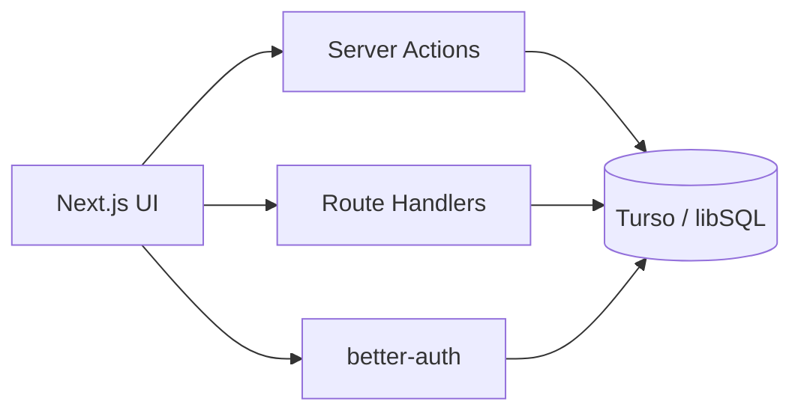
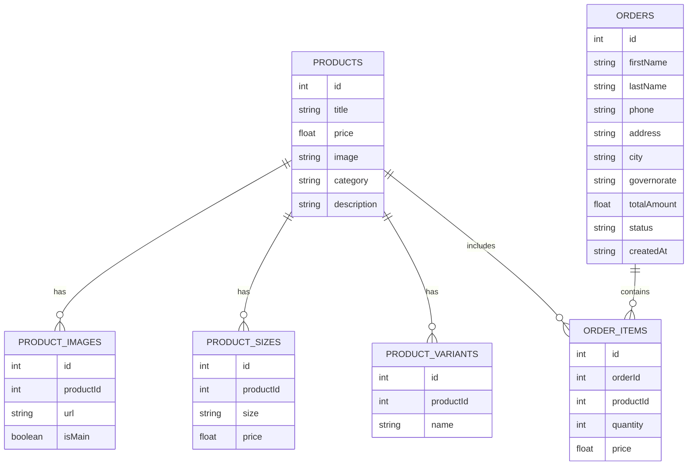

# Elghaly Coffe

**Premium coffee ecommerce experience for customers and admins.**

[](https://nextjs.org/)
[](https://www.typescriptlang.org/)
[](https://pnpm.io/)
[](LICENSE)

---

# 1. Project Title

**Elghaly Coffe**
- Tagline: Premium coffee ecommerce with a modern admin dashboard.

---

# 2. Project Overview

Elghaly Coffe is a full-stack ecommerce app focused on premium coffee products. It lets customers browse products, search, add items to a cart, and place orders through a clean checkout flow. Admins can manage products, review orders, and update order status.

**What it solves**
- Provides a complete online shopping flow for a coffee brand.
- Gives admins a dedicated panel for product and order management.

**Target users**
- Coffee customers (buyers)
- Store administrators

**Main features**
- Product catalog with variants, sizes, and images
- Search-driven discovery
- Cart and checkout with validation
- Admin dashboard for orders and product CRUD

---

# 3. Screenshots

> Replace these placeholders with real screenshots.

- Home Page
  
- Shop Page
  
- Product Details
  
- Cart
  
- Checkout
  
- Admin Dashboard
  

---

# 4. Features

- Authentication (email and password)
- Product browsing with images, sizes, and variants
- Product search and instant suggestions
- Cart system with local persistence
- Checkout flow with validation
- Order creation and admin status management
- Admin dashboard with product CRUD
- File uploads for product images
- Responsive UI for mobile and desktop
- Validation for checkout inputs and locations

---

# 5. Tech Stack

| Layer | Technology |
| --- | --- |
| Frontend | Next.js App Router, React 19 |
| Backend | Next.js Server Actions, Route Handlers |
| Database | Turso (libSQL) + Drizzle ORM |
| Authentication | better-auth |
| Upload System | uploadthing |
| Styling | Tailwind CSS 4, Radix UI |
| State Management | React Context + Hooks |
| Tooling | TypeScript, Biome |
| Package Manager | PNPM |

---

# 6. Project Structure

Tree-style overview (important folders):
- [app/](app/): Pages, layouts, routes, and server actions
- [components/](components/): Reusable UI components
- [lib/](lib/): Core logic (db, auth, schema, validation)
- [hooks/](hooks/): Custom React hooks
- [scripts/](scripts/): Migration and seeding utilities
- [utils/](utils/): Shared helpers (uploadthing helpers)
- [drizzle/](drizzle/): Database migrations and metadata

---

# 7. Architecture Overview

**Frontend to backend**
- UI calls Server Actions for secure data writes.
- Route Handlers provide API endpoints for search and uploads.

**Database flow**
- Drizzle ORM maps schema to SQL.
- Turso (libSQL) stores data.

**Authentication flow**
- better-auth manages sessions and users.
- Admin routes are protected by session and role checks.

Mermaid overview:



---

# 8. Database Schema

**Main entities**
- Products, product images, sizes, variants
- Orders and order items
- Auth tables (user, session, account, verification)

**Relationships**
- Product has many images, sizes, variants
- Order has many order items

ERD-style diagram:



---

# 9. Authentication System

- Users can sign up and sign in with email and password.
- Sessions are stored by better-auth.
- Admin routes are protected by a role check.
- Checkout is restricted to signed-in customers.

---

# 10. Checkout Flow

1. Customer adds products to the cart.
2. Cart persists locally for session continuity.
3. Customer opens checkout (requires sign-in).
4. Form validation runs (required fields, phone format, location).
5. Order is created via a Server Action.
6. Admin can review and update order status.

---

# 11. Validation System

- Checkout form validation runs before submission.
- Errors are displayed per field for clear UX.
- Governorate and city selection is dynamic using location data.
- Validation logic is centralized for reuse.

---

# 12. Installation and Setup

```bash
git clone <your-repo-url>
cd elghaly-coffe
pnpm install
```

## Environment setup
Create a `.env.local` file using the example below.

## Database setup
```bash
pnpm tsx scripts/migrate.ts
pnpm tsx scripts/seed.ts
```

## Run the app
```bash
pnpm dev
```

---

# 13. Environment Variables

Create a `.env.local` file with the following keys:

```bash
# Turso / libSQL
TURSO_DATABASE_URL=""
TURSO_AUTH_TOKEN=""

# better-auth
NEXT_PUBLIC_BETTER_AUTH_URL="http://localhost:3000"

# Admin seeding
ADMIN_EMAIL="admin@example.com"
ADMIN_PASSWORD="strong-password"

# Uploadthing (if used)
UPLOADTHING_SECRET=""
UPLOADTHING_APP_ID=""
```

---

# 14. Available Scripts

| Script | Purpose |
| --- | --- |
| `pnpm dev` | Start development server |
| `pnpm build` | Build production assets |
| `pnpm start` | Run production server |
| `pnpm lint` | Run Biome checks |
| `pnpm format` | Format code with Biome |
| `pnpm tsx scripts/migrate.ts` | Run database migrations |
| `pnpm tsx scripts/seed.ts` | Seed database and create admin |

---

# 15. API Endpoints

| Endpoint | Method | Auth | Description |
| --- | --- | --- | --- |
| `/api/auth/*` | GET, POST | Public | Auth and session endpoints |
| `/api/search/products` | GET | Public | Search data for products |
| `/api/uploadthing` | GET, POST | Session | File upload endpoint |

---

# 16. Security Notes

- Sessions are handled by better-auth.
- Admin pages are role-protected.
- Uploads require a valid session.

**Limitations**
- Server-side validation should be enforced for all mutations.
- Product and order actions should verify admin role server-side.

---

# 17. Performance Optimizations

- Server components reduce client bundle size.
- Product lists can be cached at the server layer.
- Consider pagination for large catalogs.
- Add targeted queries for product detail pages.

---

# 18. Future Improvements

- Payments (Stripe or Paymob)
- Email notifications
- Wishlist system
- Product reviews and ratings
- Multi-language support
- Analytics dashboard

---

# 19. Deployment

## Vercel
1. Push to GitHub.
2. Import the repo in Vercel.
3. Add environment variables.
4. Deploy.

## Docker
1. Build image with `pnpm build` inside Dockerfile.
2. Expose port 3000.
3. Provide `.env.local` in runtime.

## VPS
1. Install Node.js + pnpm.
2. Run `pnpm install` and `pnpm build`.
3. Use a process manager (pm2) to run `pnpm start`.

---

# 20. Contributing

1. Fork the repo.
2. Create a feature branch.
3. Commit your changes.
4. Open a pull request with a clear description.

---

# 21. License

This project is licensed under the MIT License.

---

# 22. Author

**Ali Ashraf**
- Frontend / Full Stack Developer
